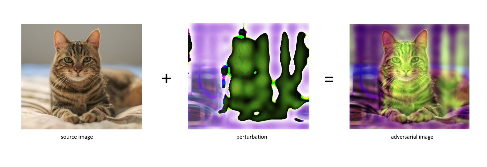

<h2 align="center">AdvHash: Adversarial collision attacks on perceptual hashing functions</h2>

[](https://circleci.com/gh/mattpodolak/advhash)
[](https://codecov.io/github/mattpodolak/advhash)
[](https://pypi.org/project/advhash/)
[](https://www.python.org/)
[](https://www.gnu.org/licenses/gpl-3.0)


## Summary

AdvHash is a Python package that provides a simple to use interface for performing adversarial collision attacks on perceptual hashing functions. 

PyTorch is used to re-create the target hashing functions and generating adversarial examples. AdvHash supports both CPU and GPU computations. Install the CUDA enabled version of PyTorch to use a GPU with AdvHash and specify `device='cuda'` when instantiating an `attack` or `hash`. 

- [Adversarial collision attacks on image hashing functions](#adversarial-collision-attacks-on-image-hashing-functions)
- [Components](#components)
- [Getting Started](#getting-started)
  - [Installation](#installation)
  - [Example Usage](#example-usage)
- [Attacks](#attacks)
- [Future Development](#future-development)
  - [Hashing Functions](#hashing-functions)
  - [Attack Methods](#attack-methods)
  - [Defense Methods](#defense-methods)
- [Contributing](#contributing)

## Adversarial collision attacks on image hashing functions


Currently AdvHash supports collision attacks on hashing functions from the popular `imagehash` package using methods described in [Adversarial collision attacks on image hashing functions](https://arxiv.org/pdf/2011.09473v1.pdf).

## Components

AdvHash is divided into multiple granular components:

| Component | Description |
| ---- | --- |
| **advhash** | a PyTorch based library for performing adversarial attacks  |
| **advhash.attack** | adversarial attack methods |
| **advhash.hash** | perceptual hashing functions |
| **advhash.utils** | utility functions for performing common resizing, conversion, and comparison operations |

## Getting Started

### Installation

`pip install advhash`

_*Install a CUDA enabled version of PyTorch to use a GPU with AdvHash._

### Example Usage

This example shows how the `L2Attack` can be used to perform an adversarial collision attack on `dHash` using the `resize` method as the target split point.

```python
import torch
import numpy as np
from PIL import Image
from advhash.attack.l2 import L2Attack

target_img = Image.open('forest.jpg')
source_img = Image.open('cat.jpg')

target = torch.tensor((np.array(target_img).astype('float32')))
source = torch.tensor((np.array(source_img).astype('float32')))

l2 = L2Attack(hash_fn='dhash', split_point='resize')

im_adv = l2.attack(target, source)
```

## Attacks
### Collision Attacks for Image Hashing
* `advhash.attack.l2.L2Attack`
* `advhash.attack.hinge.HingeAttack`

The above attacks accept a source image, target image, and hashing function as an input. The source image will be perturbed to create an adversarial image that has the same hash as the target image when hashed by the selected hashing function. Some attacks require additional configuration.

### Hashing Functions
* [dHash](https://pypi.org/project/ImageHash/)

## Future Development

### Hashing Functions

* `pHash`
* `aHash`
* `pqd`

### Attack Methods
* TBD

### Defense Methods
* TBD

## Contributing

Contributions are welcome! If you plan to contribute new features, methods, or enhancements, please open an issue to discuss the addition further, or comment on an existing issue.
